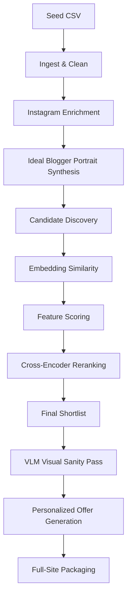

# LD Latte Influencer Discovery Pipeline

Система модульного конвейера обработки данных (**modular AI pipeline (agent-ready)**) для автоматизированного поиска, анализа, скоринга и аутрича fashion-блогеров в интересах e-commerce бренда LD Latte (Wildberries, Ozon).

---

## 1. Позиционирование и философия

Проект представляет собой **modular AI pipeline (agent-ready)** для fashion e-commerce. Мы сознательно отказываемся от монолитной концепции «магического AI-агента» (one-shot agent) в пользу структурированного пайплайна, разделенного на изолированные слои: retrieval, scoring, reranking и generation.

### Почему выбран именно такой подход:
1. **Предсказуемость и контроль**: Каждый модуль имеет четкие входные и выходные контракты данных, что позволяет дебажить и оптимизировать систему по частям.
2. **Экономия ресурсов**: Тяжелые LLM и VLM модели вызываются точечно на поздних этапах пайплайна, минимизируя затраты на инференс.
3. **Agent-Ready**: Архитектура подготовлена к тому, что в будущем отдельные слои (например, сбор данных или генерация предложений) могут быть обернуты в полноценные автономные агентские цепочки (например, с использованием LangGraph).

---

## 2. Архитектура и High-Level Flow

Пайплайн спроектирован как последовательный конвейер обработки данных:



1. **Normalized seed dataset**: Очистка и унификация стартового набора успешных интеграций.
2. **Instagram profile enrichment**: Сбор подробной информации по профилям (био, посты, вовлеченность).
3. **Ideal blogger portrait synthesis**: Анализ seed-базы и извлечение ключевых паттернов для создания формального портрета.
4. **Candidate discovery**: Поиск потенциальных кандидатов по базовым критериям.
5. **Embedding-based similarity**: Определение семантической близости кандидатов к портрету.
6. **Feature scoring**: Расчет дополнительных признаков (ER, тематика, активность).
7. **Reranking**: Финальная пересортировка с использованием кросс-энкодера.
8. **VLM visual sanity pass**: Оценка визуальной эстетики профиля (только для финального шорт-листа).
9. **Personalized offer generation**: Создание персонализированных barter-offers.
10. **Full-site packaging**: Презентация результатов на интерактивном веб-сайте.

---

## 3. Выбранная стратегия реализации (Chosen Implementation Strategy)

В рамках проектирования системы был выбран **Balanced hybrid stack** (Сбалансированный гибридный стек):
* **Почему не Ultra-pragmatic MVP?** Простые эвристические скрипты без семантического поиска и нейросетевого анализа не способны показать высокое качество подбора в fashion-сегменте, где важен контекст публикаций.
* **Почему не Strong complex agentic version?** Полностью автономная многоагентная система на базе графов имеет высокие риски нестабильности (бесконечные циклы, галлюцинации планирования) и требует значительного времени на отладку.
* **Balanced hybrid stack** представляет собой прагматичное инженерное решение: жесткий детерминированный пайплайн для сбора и фильтрации данных совмещается с продвинутыми LLM/VLM моделями на этапах синтеза портрета, реранкинга и генерации.

---

## 4. Выбранный технологический стек (Current Chosen Stack)

### Scraping Layer (Сбор данных)
* **Primary**: [Instaloader](https://github.com/instaloader/instaloader) — автономное self-operated решение для сбора открытых профилей и постов.
* **Fallback**: [Playwright](https://playwright.dev) с авторизованной сессией для имитации действий пользователя в браузере при возникновении блокировок.
* **Emergency Only**: [Apify](https://apify.com) — облачный SaaS-парсер, используемый исключительно как крайняя мера (emergency backup) при полной блокировке локальных IP-адресов. Не является штатной основой пайплайна.

> [!IMPORTANT]
> **Ограничения Instagram API**: Официальный Instagram Basic Display API закрыт. Graph API не подходит для нашей задачи, так как он ограничен только профилями типов Business/Creator, принадлежащих самому владельцу приложения, и требует прохождения модерации (App Review). Поэтому пайплайн строится на базе **self-operated scraping**.

### CAPTCHA / Anti-bot Note (Обход защит)
* Для парсинга используется выделенный технический аккаунт (*sacrificial account*).
* Ручное решение капч (manual captcha solving) допускается на уровне MVP, так как объемы сбора данных ограничены масштабами тестового задания (assignment-scale throughput).
* Применение Playwright с плагинами маскировки (*stealth*) при автоматизации браузера.
* Агрессивное кэширование запросов и троттлинг для минимизации рисков блокировки.

### Embeddings Stack (Текстовые эмбеддинги)
* **Primary**: [Qwen3-Embedding-0.6B](https://huggingface.co/Qwen/Qwen3-Embedding-0.6B) — легкая и эффективная мультиязычная модель эмбеддингов.
* **Upgrade Option**: [Qwen3-Embedding-4B](https://huggingface.co/Qwen/Qwen3-Embedding-4B) для повышения точности семантического поиска.
* *Примечание*: Мультиязычная модель `multilingual-e5-large` исключена из числа основных вариантов по умолчанию.

### Reranker (Реранкер)
* **Primary**: [BAAI/bge-reranker-v2-m3](https://huggingface.co/BAAI/bge-reranker-v2-m3) — современный мультиязычный кросс-энкодер для семантического ранжирования кандидатов.
* **Fallback**: Jina Multilingual Reranker.

### LLM Stack (Языковые модели)
* **Primary Provider**: **Groq API** (высокая скорость инференса).
* **Fallback Provider**: **OpenRouter** (резервный доступ к альтернативным и бесплатным моделям).
* **Разделение ролей**:
  * Быстрые и дешевые модели (например, Llama-3-8B) используются для массового извлечения структурированных фактов из био и постов.
  * Тяжелые модели (например, Llama-3-70B или аналоги) используются для синтеза портрета идеального блогера и написания персонализированных barter-offers.

### Visual Layer (Визуальный анализ)
* **hosted Qwen2.5-VL / Qwen3-VL** через API.
* **Важное ограничение**: VLM **не участвует** в первичном поиске и фильтрации (baseline retrieval layer). Он используется строго на этапе **sanity-check для финального шорт-листа (top 3–5 кандидатов)** для оценки эстетического соответствия ленты блогера стилю LD Latte.

### Site Packaging (Финальная упаковка)
* Результаты работы упаковываются в интерактивный **веб-сайт (Demo UI)** на базе HTML/CSS/JS (папка `app/`).
* README.md остается инженерным навигатором, но финальная демонстрация проводится через веб-сайт. Сайт включает:
  * Hero-секция с презентацией проекта.
  * Описание архитектуры и шагов пайплайна.
  * Интерактивный анализ seed-базы и портрет идеального блогера.
  * Таблица кандидатов с фильтрацией, оценками (composite scores) и обоснованием.
  * Сгенерированные barter-offers с подсветкой персонализированных элементов.
  * Раздел с промптами и инструкциями для запуска.

---

## 5. Вне рамок MVP (Out of Scope)

* Построение полной аналитики социального графа (follower-graph) инфлюенсеров.
* Мультимодальный поиск и ретривал по изображениям на больших объемах данных.
* Автоматическая отправка сообщений (Direct Messages) в Instagram (только генерация черновиков).
* Полноценная поддержка Telegram и YouTube Shorts (рассматриваются как future extensions).
* Продакшн-оптимизация (базы данных, очереди задач, авторизация, горизонтальное масштабирование).

---

## 6. Быстрый запуск (Quick Start)

*(Инструкции будут дополняться по мере реализации пайплайна)*

### Шаг 1: Настройка виртуального окружения (Рекомендуется)
Создайте и активируйте виртуальное окружение:
* **Windows (PowerShell)**:
  ```powershell
  python -m venv .venv
  .venv\Scripts\Activate.ps1
  ```
* **Linux/macOS**:
  ```bash
  python3 -m venv .venv
  source .venv/bin/activate
  ```

### Шаг 2: Установка зависимостей
Установите основные зависимости проекта:
```bash
pip install -r requirements.txt
```

### Шаг 3: Настройка GPU (NVIDIA Cuda)
По умолчанию PyTorch устанавливается для работы на CPU. Чтобы перенести вычисления локальных моделей эмбеддингов (`Qwen3-Embedding`) и реранкера (`BGE-Reranker`) на видеокарту NVIDIA (например, RTX 3050), выполните переустановку PyTorch с поддержкой CUDA:
```bash
pip install torch --index-url https://download.pytorch.org/whl/cu124 --force-reinstall
```

### Шаг 4: Настройка конфигурации
1. Скопируйте файл конфигурации `.env.example` в `.env`:
   ```bash
   cp .env.example .env
   ```
2. Откройте `.env` и при необходимости укажите API-ключи `GROQ_API_KEY` и `OPENROUTER_API_KEY`. Если ключи не указаны, сетевой блок LLM будет пропущен в тестах, а локальные модели всё равно пройдут проверку.

### Шаг 5: Проверка работоспособности стека (Smoke Test)
Запустите диагностический скрипт для автоматической проверки подключения к API и корректности инференса локальных моделей:
```bash
python -m src.shared.smoke_test
```

### Шаг 6: Запуск очистки данных (TICKET-01)
Поместите исходный seed-файл в `data/raw/Блогеры - Лист1.csv` и запустите скрипт нормализации:
```bash
python src/ingest/clean.py
```

### Шаг 7: Обогащение профилей Instagram (TICKET-04)
Запустите конвейер сбора и обогащения данных для нормализованных seed-профилей.

* **Тестовый локальный прогон (Mock Sandbox Mode)**:
  ```bash
  python -m src.fetchers.enrich --mock
  ```
* **Запуск в живом режиме (Instaloader -> Playwright Fallback)**:
  ```bash
  python -m src.fetchers.enrich
  ```
* **Запуск smoke-теста обогащения**:
  ```bash
  python -m tests.test_enrich_mock
  ```
  Результат обогащения сохраняется в `data/processed/seed_enriched.json`.

### Шаг 8: Создание идеального портрета (TICKET-05)
Запустите модуль синтеза портрета идеального блогера на основе `data/processed/seed_enriched.json`:
* **Стандартный запуск (LLM Groq / OpenRouter fallback)**:
  ```bash
  python -m src.analyzers.portrait
  ```
* **Запуск в детерминированном offline/fallback режиме**:
  ```bash
  python -m src.analyzers.portrait --force-fallback
  ```
* **Запуск юнит-тестов профилировщика**:
  ```bash
  python -m pytest tests/test_ideal_portrait.py -v
  ```
  Результат синтеза сохраняется в `data/processed/ideal_portrait.json` в соответствии с Pydantic-схемой `IdealBloggerProfile`.

### Шаг 9: Поиск и фильтрация кандидатов (Candidate Discovery, TICKET-06)
Запустите модуль поиска и детерминированной rule-based фильтрации кандидатов из локального пула `data/raw/candidates_pool.json`:
* **Запуск поиска кандидатов (CLI entrypoint)**:
  ```bash
  python -m src.search.discover
  ```
* **Запуск тестов модуля Candidate Discovery**:
  ```bash
  python -m pytest tests/test_candidate_discovery.py -v
  ```
  Результат сохраняется в `data/processed/candidates_discovered.json` в виде массива Pydantic-моделей `CandidateProfile`.

### Шаг 10: Векторный поиск и скоринг фич (Embedding & Feature Scoring, TICKET-07)
Запустите модуль векторизации и фичевого скоринга:
* **Расчет эмбеддингов Qwen3-Embedding-0.6B**:
  ```bash
  python -m src.scoring.embed
  ```
* **Детерминированный скоринг фич и композитная оценка**:
  ```bash
  python -m src.scoring.score
  ```
* **Запуск тестов скоринга**:
  ```bash
  python -m pytest tests/test_scoring_basic.py -v
  ```
  Результат сохраняется в `data/processed/candidates_scored.json` и генерируется отчет `output/embedding_debug_report.md`.

### Шаг 11: Реранкинг и визуальный контроль (Reranking & VLM Sanity Pass, TICKET-08)
Запустите слой Cross-Encoder Reranking и VLM Visual Sanity Pass:
* **Cross-Encoder Reranking (BAAI/bge-reranker-v2-m3)**:
  ```bash
  python -m src.scoring.rerank
  ```
  Создает `data/processed/candidates_reranked.json` и выгружает top-10 в `data/processed/shortlist_raw.json`.
* **VLM Visual Sanity Pass (Qwen2.5-VL / Qwen3-VL / Mock Sandbox Mode)**:
  ```bash
  python -m src.scoring.vlm_sanity
  ```
  Выполняет эстетический контроль top 3–5 кандидатов и создаёт `data/processed/shortlist_final.json` по Pydantic-контракту `FinalShortlistEntry`.
* **Запуск тестов реранкинга и VLM**:
  ```bash
  python -m pytest tests/test_rerank_vlm.py -v
  ```

### Шаг 12: Генерация бартерных офферов и QA (Outreach Generator & QA, TICKET-09)
Запустите модуль генерации персонализированных коммерческих писем (бартерных офферов) на базе **DeepSeek-V4** (OpenRouter) / **Groq API**:
* **Генерация бартерных предложений (CLI entrypoint)**:
  ```bash
  python -m src.outreach.generator
  ```
* **Запуск тестов модуля Outreach Generator & QA**:
  ```bash
  python -m pytest tests/test_outreach_generator.py -v
  ```
  Результат сохраняется в `output/barter_offers.json` в виде массива Pydantic-моделей `OutreachDraft`. Все письма проходят QA-контроль на естественность речи (anti-robotic validation) и 100% заземление на реальных фактах из профилей блогеров.

---


## 7. Ссылки, сформировавшие стек (References)

* **Модели и API**:
  * [Groq Active Models Docs](https://console.groq.com/docs/models)
  * [Groq Deprecations list](https://console.groq.com/docs/deprecations)
  * [OpenRouter Free Models](https://openrouter.ai/collections/free-models)
* **Скрапинг**:
  * [Instaloader GitHub / Docs](https://github.com/instaloader/instaloader) | [Instaloader Site](https://instaloader.github.io/)
  * [Playwright Captcha & Stealth](https://github.com/oxylabs/playwright-captcha)
* **Эмбеддинги и Реранкеры**:
  * [Qwen3-Embedding-0.6B on HuggingFace](https://huggingface.co/Qwen/Qwen3-Embedding-0.6B)
  * [Qwen3-Embedding-4B on HuggingFace](https://huggingface.co/Qwen/Qwen3-Embedding-4B)
  * [BAAI bge-reranker-v2-m3 on HuggingFace](https://huggingface.co/BAAI/bge-reranker-v2-m3)
* **Мультимодальные модели**:
  * [Qwen2.5-VL Transformers Docs](https://huggingface.co/docs/transformers/model_doc/qwen2_5_vl)
* **Теоретические основы**:
  * [SAGraph: Graph Interest Match Paper](https://arxiv.org/pdf/2403.15105.pdf)
  * [OpenCrowd Paper on Crowdsourced Influencer Selection](http://doc.rero.ch/record/330498/files/2020_Cudre-Mauroux_OpenCrowd.pdf)
