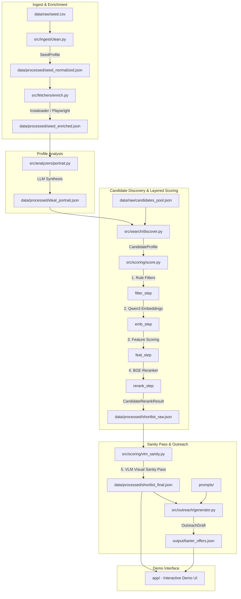

# Архитектура системы (ARCHITECTURE.md)

В данном документе приведено детальное техническое описание архитектуры системы поиска, анализа и аутрича блогеров для бренда **LD Latte** (сегмент fashion e-commerce).

---

## 1. Миссия и обзор системы

### Миссия
Создание надежного, гибкого и воспроизводимого инструмента (конвейера обработки данных), который позволяет fashion-бренду на основе небольшого исходного списка успешных интеграций (seed-датасета) автоматически подбирать новых качественных кандидатов в Instagram, оценивать их соответствие стилю и метрикам бренда и генерировать персонализированные коммерческие предложения (бартер).

### Позиционирование: Modular AI Pipeline (agent-ready)
Система спроектирована не как монолитный «AI-агент», а как модульный конвейер обработки данных (**modular AI pipeline**):
* **Разделение ответственности**: Процессы очистки данных, парсинга, эмбеддингов, скоринга, реранкинга, визуальной валидации и генерации писем полностью изолированы друг от друга.
* **Agent-Ready**: Архитектура спроектирована так, что в будущем любой из модулей (например, скрапер или генератор писем) может быть обернут в автономного AI-агента с инструментами принятия решений (tool-calling, циклы рассуждений), без изменения структуры остальных блоков.
* **Управляемость**: Отсутствуют риски «галлюцинаций планирования» общего агента. Весь поток данных полностью детерминирован и прозрачен для проверки.

### Финальное архитектурное решение: Balanced Hybrid Stack
Для проекта выбран **Balanced hybrid stack** (Сбалансированный гибридный стек):
1. **Почему не Ultra-pragmatic MVP?** Обычный скрипт с жесткими правилами и regex-фильтрами не способен уловить тонкие стилистические особенности fashion-аккаунтов (стиль одежды, тональность общения, эстетика визуального ряда).
2. **Почему не Strong complex agentic version?** Агентские фреймворки на базе графов (например, LangGraph с постоянным репланированием) избыточны для линейного конвейера, потребляют слишком много токенов и сложны в локальной отладке.
3. **Balanced hybrid stack** сочетает скорость и простоту локального выполнения с силой семантического поиска (мультиязычные эмбеддинги Qwen3), кросс-энкодер реранкинга (BGE Reranker) и точечного применения VLM-моделей только на финальной стадии проверки.

---

## 2. Схема пайплайна (Pipeline Flow)

Ниже приведена обновленная схема движения данных в системе:

---

## 3. Описание модулей репозитория

* **`src/ingest`**: Очищает сырой seed CSV-файл. Нормализует ссылки, вычленяет уникальные usernames, удаляет tracking-параметры.
* **`src/fetchers`**: Слой сбора данных (fetcher layer). Собирает био, посты, количество подписчиков и лайков. Поддерживает локальные Mock-файлы для тестирования без сети.
* **`src/analyzers`**: Синтезирует детальный профиль идеального инфлюенсера на основе объединенных данных успешных интеграций (seed).
* **`src/search`**: Модуль поиска кандидатов. Сканирует пул кандидатов и выдает базовые профили для скоринга.
* **`src/scoring`**: Модуль многоуровневого ранжирования. Отвечает за расчет эмбеддингов, пофичевый скоринг, реранкинг кросс-энкодером и финальную визуальную валидацию через VLM (hosted API).
* **`src/outreach`**: Отвечает за генерацию писем бартерного предложения с высокой степенью персонализации (цитирование постов, соответствие tone of voice).
* **`src/shared`**: Общие утилиты, обертки над API Groq/OpenRouter, функции логирования и загрузки `.env`.
* **`app`**: Локальный веб-сайт (Demo UI) для интерактивной демонстрации результатов работы системы.

---

## 4. Контракты данных (Data Contracts)

Все сущности описываются в виде классов `Pydantic` для строгой валидации данных при переходе между модулями.

### `SeedProfile`
*Исходная запись из seed-файла после первичной очистки.*
* **username**: `str` (нормализованный никнейм)
* **raw_url**: `str` (исходная ссылка)
* **is_valid**: `bool` (прошел ли проверку формата)
* **error_message**: `Optional[str]` (описание ошибки)

### `EnrichedSeedProfile`
*Профиль seed-блогера, обогащенный данными из Instagram.*
* **username**: `str`
* **biography**: `str`
* **followers_count**: `int`
* **posts_count**: `int`
* **engagement_rate**: `float`
* **recent_posts**: `List[dict]` (посты с текстом, датой, лайками)
* **activity_recency**: `int` (дней с последнего поста)
* **language**: `str` (определенный язык профиля, например: "ru")
* **niche**: `str` (fashion, beauty, lifestyle и др.)
* **caption_tone**: `str` (дружелюбный, экспертный, минималистичный)
* **sponsorship_saturation**: `str` (low, medium, high — уровень заспамленности рекламой)

### `IdealBloggerProfile`
*Сводный портрет идеального блогера, синтезированный LLM.*
* **target_niches**: `List[str]` (целевые ниши)
* **estimated_er_min**: `float` (минимальный ER)
* **key_themes**: `List[str]` (ключевые темы контента)
* **preferred_tone_of_voice**: `str` (желаемый Tone of Voice)
* **sponsorship_saturation_max**: `str` (максимально допустимый уровень рекламы)
* **activity_recency_max_days**: `int` (максимальный простой в днях)
* **rationale**: `str` (текстовое обоснование на основе seed-данных)

### `CandidateProfile`
*Данные кандидата, найденного на этапе Discovery, подготовленные к скорингу.*
* **username**: `str`
* **biography**: `str`
* **followers_count**: `int`
* **engagement_rate**: `float`
* **recent_posts**: `List[dict]`
* **language**: `str`
* **niche**: `str`
* **caption_tone**: `str`
* **product_talk_style**: `str` (как рассказывает о продуктах)
* **sponsorship_saturation**: `str`
* **activity_recency**: `int`
* **contact_info**: `Optional[str]`

### `CandidateFeatureScore`
*Промежуточные оценки кандидата по жестким критериям.*
* **username**: `str`
* **niche_match_score**: `float` (0.0 - 1.0)
* **er_match_score**: `float` (0.0 - 1.0)
* **recency_match_score**: `float` (0.0 - 1.0)
* **sponsorship_match_score**: `float` (0.0 - 1.0)
* **language_match_score**: `float` (0.0 - 1.0)

### `CandidateRerankResult`
*Результат семантического и взвешенного ранжирования.*
* **username**: `str`
* **semantic_similarity**: `float` (косинусное сходство векторных представлений био/постов к seed-центроиду)
* **features_score**: `float` (агрегированная оценка по числовым фичам)
* **cross_encoder_score**: `float` (оценка релевантности от BGE Reranker)
* **composite_score**: `float` (итоговый взвешенный балл)
* **similarity_breakdown**: `dict` (детализация совпадений и расхождений)

### `FinalShortlistEntry`
*Запись финального шорт-листа, прошедшая визуальный контроль.*
* **username**: `str`
* **rerank_result**: `CandidateRerankResult`
* **vlm_sanity_passed**: `bool` (пройдена ли проверка визуальной эстетики)
* **vlm_aesthetic_notes**: `str` (описание визуального стиля и вердикт VLM)
* **grounding_facts**: `List[str]` (конкретные факты из профиля для персонализации оффера)

### `OutreachDraft`
*Сгенерированное персонализированное предложение.*
* **username**: `str`
* **subject**: `str`
* **body**: `str` (текст оффера на языке блогера)
* **language**: `str`
* **personalized_elements**: `List[str]` (упоминания конкретных постов/тем)
* **grounding_facts**: `List[str]` (факты, подтверждающие релевантность)

---

## 5. Стратегия извлечения и скоринга (Retrieval & Scoring)

Система использует **многоуровневый (layered) подход** к фильтрации и ранжированию, чтобы минимизировать нагрузку на тяжелые модели:

1. **Этап 1: Cheap Rule Filters (Быстрые фильтры)**:
   Отсечение кандидатов по жестким критериям: слишком мало/много подписчиков, ER ниже порога, отсутствие постов более 30 дней, нерелевантный язык.
2. **Этап 2: Embedding Similarity (Векторный поиск)**:
   Вычисление косинусного сходства текстовых векторов (био + склеенные тексты последних постов) кандидата с центроидом seed-профилей с использованием модели **Qwen3-Embedding-0.6B**.
3. **Этап 3: Hand-crafted Feature Scoring (Фичевый скоринг)**:
   Расчет композитной оценки по формуле:
   $$\text{score}_{\text{features}} = w_1 \cdot \text{niche\_match} + w_2 \cdot \text{er\_score} + w_3 \cdot \text{sponsorship\_score}$$
   *Все веса настраиваются в конфигурационном файле.*
4. **Этап 4: Cross-Encoder Reranking (Пересортировка)**:
   Сравнение сырого текста био и лучших постов кандидата с текстовым описанием идеального портрета через **BAAI/bge-reranker-v2-m3** для устранения недостатков векторного поиска.
5. **Этап 5: VLM Visual Sanity Pass (Визуальный контроль)**:
   * **Важно**: VLM-модели тяжелы и дороги в инференсе, поэтому VLM **не участвует** в первичном поиске и фильтрации.
   * Вызывается **только для топ 3–5 кандидатов**, прошедших реранкер.
   * VLM (Qwen2.5-VL / Qwen3-VL) анализирует скриншот/коллаж сетки профиля блогера, оценивая соответствие эстетике бренда (минимализм, пастельные тона, качество съемки) и отсекая «визуальный мусор».

---

## 6. Стратегия скрапинга (Scraping Strategy)

Сбор данных в Instagram нестабилен и подвержен жестким ограничениям. Архитектура учитывает это и выстраивает следующую иерархию (execution order):

1. **Primary path (Instaloader)**:
   Автономная библиотека на Python. Выполняет базовые запросы к открытым страницам. Эффективна для сбора текстовых метаданных профилей.
2. **Fallback path (Playwright authenticated session)**:
   При возникновении ошибок или капч Instaloader-а запускается локальный браузер через Playwright. Он использует сохраненную сессию авторизованного технического аккаунта (sacrificial account) для обхода экранов логина. При необходимости прохождения капчи система приостанавливает выполнение для ручного ввода пользователем (manual captcha solving).
3. **Emergency Only path (Apify SaaS)**:
   Облачные прокси-парсеры. Вызываются только в крайнем случае, если локальный скрапинг полностью заблокирован. Не рассматриваются как базовая часть пайплайна для MVP.

### Защита от банов:
* Внедрение случайных пауз (sleep delay) между запросами.
* Локальное кэширование ответов (snapshots): если данные профиля уже были успешно собраны за последние 24 часа, повторный запрос к сети не производится.
* Объем обработки — масштабы тестового задания, что исключает попадание под лимиты агрессивного скрапинга.

---

## 7. Матрица моделей (Model Role Matrix)

| Роль в пайплайне | Первичная модель | Резервный вариант | Обоснование выбора |
| :--- | :--- | :--- | :--- |
| **Bulk Classifier (Парсер фактов)** | Llama-3-8b (Groq) | Qwen2.5-7B (OpenRouter) | Дешевое и быстрое структурирование био/постов в JSON. |
| **Portrait Synthesizer (Синтез портрета)** | Llama-3-70b (Groq) | Claude-3-Haiku (OpenRouter) | Требуются хорошие аналитические способности для обобщения данных. |
| **Text Embeddings (Векторизация)** | Qwen3-Embedding-0.6B | Qwen3-Embedding-4B | Высокое качество мультиязычного представления текста. |
| **Reranker (Реранкинг)** | BAAI/bge-reranker-v2-m3 | Jina Reranker | Мощный мультиязычный кросс-энкодер. |
| **VLM Aesthetic Judge (Визуальный анализ)**| Qwen2.5-VL / Qwen3-VL | GPT-4o-mini | Высокая точность понимания эстетики изображений через hosted API. |
| **Offer Generator (Генератор писем)** | Llama-3-70b (Groq) | Qwen2.5-72B (OpenRouter) | Требуется высокий уровень владения естественным языком (русским/английским) для персонализации. |

---

## 8. Риски проекта (Risk Register)

* **Риск 1: Изменение верстки/защиты Instagram (Высокий риск / Высокий импакт)**:
  * *Смягчение*: Изолированный fetcher-слой с поддержкой Mock-данных. Если парсинг падает, система продолжает работу на стабильных предзагруженных снапшотах.
* **Риск 2: Блокировка аккаунта скрапинга (Средний риск / Средний импакт)**:
  * *Смягчение*: Использование sacrificial account, медленные таймауты, Playwright с имитацией действий человека.
* **Риск 3: Превышение лимитов (Rate Limits) бесплатных API (Низкий риск / Средний импакт)**:
  * *Смягчение*: Кэширование запросов, автоматическое переключение на OpenRouter при ошибке 429 от Groq.
* **Риск 4: Языковой дрейф (Низкий риск / Средний импакт)**:
  * *Смягчение*: Определение языка профиля на этапе Enrichment и передача флага в генератор писем для автоматического выбора языка аутрича.

---

## 9. Вне зоны внимания (Non-Goals)

1. Создание постоянной базы данных (PostgreSQL, MongoDB) и миграций.
2. Автоматическая отправка писем или DM сообщений (аутрич создает только драфты).
3. Интеграция с Telegram API или YouTube API в качестве основного функционала MVP.
4. Разработка сложной агентской логики репланирования (например, AutoGPT). Пайплайн линеен и стабилен.
