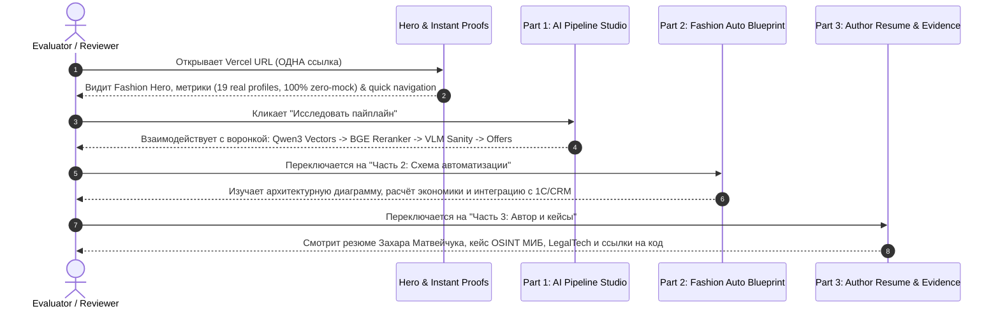

# 📐 TICKET-10A — Research & Information Architecture for LD Latte Public Demo UI

> **Статус артефакта**: `APPROVED / SOURCE OF TRUTH`  
> **Дата создания**: 2026-07-22  
> **Автор**: Antigravity AI Agent & Захар Матвейчук  
> **Назначение**: Руководящий исследовательский и проектировочный документ для этапов TICKET-10B..10G. Фиксирует визуальную эстетику, информационную архитектуру, путь проверяющего (Evaluator Journey) и правила упаковки 3 частей тестового задания LD Latte в единую публичную веб-витрину.

---

## 1. Purpose of TICKET-10A (Цели и границы этапа)

**Главная задача TICKET-10A** — провести системное исследование и спроектировать информационную архитектуру (IA) для публичного веб-сайта **LD Latte Demo UI** в папке `app/` с будущим автоматическим деплоем на Vercel.

### Жесткие операционные границы (Hard Constraints):
1. **Zero UI Code**: На этапе TICKET-10A **запрещено** создавать UI-компоненты в `app/` или писать продуктовый код.
2. **Zero Architecture Drift**: Сохраняется жестко зафиксированный фрейминг: **modular AI pipeline (agent-ready)**. Проект запрещено позиционировать как «монолитный AI-агент» или автономный неконтролируемый цикл.
3. **Единая ссылка («ОДНА ссылка»)**: Веб-сайт должен объединять все 3 части тестового задания LD Latte:
   * **Часть 1**: Инструмент поиска блогеров, воронка скоринга (Qwen3-Embedding + BAAI BGE-Reranker + VLM Visual Sanity), промпты, схема автоматизации, шорт-лист и персонализированные бартерные офферы.
   * **Часть 2**: Концепция и архитектура сквозной автоматизации fashion e-commerce.
   * **Часть 3**: Портфолио и резюме автора из [`Matvejchuk_Zakhar_Master_Resume_v8.md`](file:///c:/Users/Admin/Desktop/LD%20LATTE/Matvejchuk_Zakhar_Master_Resume_v8.md).
4. **100% Real Data Integrity**: Все данные в интерфейсе берутся strictly из реально выгруженных 19 профилей Instagram и сгенерированных артефактов пайплайна без фейковых генераторов или mock-заглушек (в соответствии с [`docs/POLICY.md`](file:///c:/Users/Admin/Desktop/LD%20LATTE/docs/POLICY.md)).
5. **Fashion-First + Technical Evidence**: Эстетика сайта должна вызывать ощущения премиального fashion-бренда женской одежды, но при этом давать мгновенный доступ к математическим и инженерным доказательствам (векторы, логиты реранкера, VLM-вердикты, исходный код).

---

## 2. Input Documents Reviewed (Анализ входной документации)

В ходе этапа TICKET-10A были детально изучены и верифицированы следующие локальные и публичные документы:

| Документ | Ключевые выводы и ограничения для UI |
| :--- | :--- |
| **`docs/AGENT_RULES.md`** | Позиционирование: только *modular AI pipeline (agent-ready)*. Максимум 3 файла за проход. Обязательный деплой на Vercel в `app/`. Не трогать стабильные Python-компоненты. |
| **`docs/ARCHITECTURE.md`** | 5-этапная воронка отбора: Cheap Rules $\rightarrow$ Qwen3-Embedding (0.6B) $\rightarrow$ Hand-crafted Feature Scoring $\rightarrow$ BGE-Reranker-v2-m3 $\rightarrow$ VLM Sanity Pass (Qwen2.5-VL). Описаны все Pydantic-контракты данных. |
| **`docs/STATE.md`** | Фиксация статуса: 100% выполнена расчетная и генеративная часть (TICKET-01..TICKET-09A). 19 реально спарсенных профилей. 15 недоступных профилей отсеяны. Написано 39 юнит- и интеграционных тестов (100% PASS). |
| **`docs/POLICY.md`** | Strict Zero-Mock Data Policy. Запрет на демонстрацию выдуманных аккаунтов. В UI попадают только реальные профили (`_kate_bruni`, `juliar_r`, `v.m.Beauty_blog`, `anetboss_`, `kristi_naxodka`, `jd_cosm`, `armlilitka`, `mishandkatya` и др.). |
| **`README.md`** | Инженерный навигатор проекта. Стек: Python, Playwright, Instaloader, Qwen3-Embedding, BGE-Reranker, Groq/OpenRouter, DeepSeek-V4. Пошаговые инструкции запуска. |
| **`Matvejchuk_Zakhar_Master_Resume_v8.md`** | Резюме автора (Захар Матвейчук, ИГУ, BIT Чжухай). Ключевые кейсы: OSINT-агрегатор МИБ (Дипакадемия МИД), LegalTech Intake Dashboard, Approval Service. AI-native подход (Plan $\rightarrow$ Approve $\rightarrow$ Execute $\rightarrow$ Audit). |

---

## 3. Existing Pipeline Artifacts to Surface in UI (Артефакты пайплайна для вывода в интерфейс)

Интерфейс не должен быть абстрактным концептом. Он обязан служить живой витриной над **реальными файлами и результатами**, созданной на предыдущих этапах:

```
c:\Users\Admin\Desktop\LD LATTE\
├── data/processed/
│   ├── seed_enriched.json                   --> [UI: Интерактивный разбор 19 seed-профилей]
│   ├── ideal_portrait.json                  --> [UI: Сводный портрет идеального блогера LD Latte]
│   ├── candidates_discovered.json           --> [UI: Пул кандидатов после Rule-based отбора]
│   ├── candidates_scored.json               --> [UI: Векторное сходство Qwen3 + Feature Scores]
│   ├── candidates_reranked.json             --> [UI: Cross-Encoder BGE-Reranker логиты и баллы]
│   └── shortlist_final.json                 --> [UI: Топ шорт-лист + VLM Visual Sanity вердикты]
├── output/
│   ├── barter_offers.json                   --> [UI: Готовые персонализированные бартерные офферы]
│   ├── pipeline_audit_report.md             --> [UI: Аудит конверсии воронки и качество данных]
│   └── seed_cleanup_report.md               --> [UI: Отчет очистки исходного датасета]
├── prompts/
│   └── outreach_offer.md                    --> [UI: Инспекция системного промпта генератора]
└── Matvejchuk_Zakhar_Master_Resume_v8.md    --> [UI: Резюме и портфолио автора (Часть 3)]
```

---

## 4. LD Latte Brand / Visual Research (Исследование бренда LD Latte)

### A. Публичные сигналы бренда (Brand Identity Signals)
На основе анализа присутствия LD Latte (LDLATTE) на Wildberries, Ozon и в социальных сетях установлены ключевые визуальные и позиционные характеристики:
* **Категория**: Российский бренд женской одежды и белья (костюмы, брюки клеш, юбки мини/карандаш, вельветовые комплекты, жилеты, топы).
* **Характер и Tone of Voice**: Романтичные силуэты, женственность, подчеркнутая индивидуальность, элегантный минимализм с ноткой дерзости («элегантный городской шик»).
* **Визуальная эстетика**: Теплые кофейно-молочные тона (latte, espresso, warm beige, cream), чистые линии, тактильные текстуры тканей, отсутствия кричащего спортивного или уличного неонового декора.

### B. Сравнение 3 допустимых концепций стиля (Mood Directions)

| Критерий | Направление 1: Dark Tech SaaS (Generic AI) | Направление 2: Strict Editorial Minimal | Направление 3: Warm Editorial Tech (Fashion-First Hybrid) [РЕКОМЕНДОВАНО] |
| :--- | :--- | :--- | :--- |
| **Палитра** | Чёрный неон `#090D16` + синий `#3B82F6` | Бело-серый монохром `#FFFFFF` + `#111111` | Теплый эспрессо `#161210` / топлёное молоко `#FAF7F2` + капучино `#D4C4B7` + розоватое золото `#C88D74` |
| **Шрифты** | Inter / Roboto / System Monospace | Bodoni / Didot + Helvetica | Modern Serif (`Playfair Display` / `Cinzel` / `Outfit`) + Technical Sans (`Inter` / `Plus Jakarta Sans`) |
| **Ощущение бренда** | Шаблонный крипто/SaaS инструмент | Журнал Vogue / Architectural Digest | Премиальный модный дом с собственной лабораторией AI |
| **Применимость для LD Latte** | ❌ Низкая (выглядит как очередной AI-wrapper) | ⚠️ Средняя (сложно показывать графики и векторов) | ✅ Идеальная (сочетает модность и доказательность) |

---

## 5. Recommended Visual Direction (Рекомендуемое визуальное направление)

Выбираем **Warm Editorial Tech (Fashion-First Hybrid)**.

```
+-----------------------------------------------------------------------------------+
|  COLOR PALETTE:                                                                    |
|  [#161210] Espresso Dark Background / Text Primary in Light Mode                  |
|  [#FAF7F2] Warm Cream (Milk Foam) Background Light / Card fill in Dark Mode       |
|  [#D4C4B7] Soft Latte (Neutral Grey-Beige for Borders & Dividers)                  |
|  [#C88D74] Rose Gold Warm Accent (CTA, Highlights, Badges)                         |
|  [#4A3E39] Deep Roast (Secondary Text & Muted Icons)                               |
|                                                                                   |
|  TYPOGRAPHY VECTOR:                                                               |
|  - Display Headings: "Outfit" (semi-bold) or "Playfair Display" (serif elegance)  |
|  - Body & UI Data: "Plus Jakarta Sans" or "Inter" (clean legibility at 12-14px)  |
|  - Monospace Data (Vectors, Logits): "JetBrains Mono" or "Fira Code"              |
|                                                                                   |
|  FAVICON & BRAND MARK CONCEPT:                                                    |
|  - Векторная монограмма "LD" с плавной дугой струи латте, переходящей в           |
|    градиентную AI-точку (узловой вектор). Символизирует моду и нейросети.          |
+-----------------------------------------------------------------------------------+
```

---

## 6. Audience & Evaluator Journey (Карта пути проверяющего)

Проверяющий (лид HR/Tech Lead/Основатель LD Latte) приходит на сайт по **ОДНОЙ ссылке**. Сайт должен моментально дать ответы на 3 ключевых вопроса:
1. *«Сделал ли кандидат работающий инструмент под задачу LD Latte?»* $\rightarrow$ **Часть 1** (Интерактивная воронка, VLM-аналитика, офферы).
2. *«Понимает ли кандидат, как автоматизировать этот процесс в масштабе бизнеса?»* $\rightarrow$ **Часть 2** (Архитектура, SLA, экономика).
3. *«Кто автор и можно ли ему доверять сложные AI-проекты?»* $\rightarrow$ **Часть 3** (Резюме Захара Матвейчука, живые ссылки на GitHub/Vercel).



---

## 7. Website Information Architecture (Информационная архитектура сайта)

Используется **Hybrid Narrative Shell**: Одностраничный плавный скролл с нативными якорями + Фиксированный верхний переключатель режимов (Sticky Part Switcher).

```
+-----------------------------------------------------------------------------------+
|  STICKY HEADER / NAVIGATION BAR                                                   |
|  [Logo: LD LATTE AI]   (1) Часть 1: Инструмент  (2) Часть 2: Схема  (3) Автор    |  [Github Repo ↗]
+-----------------------------------------------------------------------------------+
|  SECTION 1: HERO & PROOF METRICS                                                  |
|  - Title: Modular AI Pipeline for LD Latte Influencer Discovery                   |
|  - Subtitle: Сквозной конвейер поиска, эмбеддингов, реранкинга и VLM-контроля     |
|  - Proof Badges: [19 Real Profiles] [Zero-Mock Policy] [39 Tests PASS]            |
+-----------------------------------------------------------------------------------+
|  SECTION 2: PART 1 — INTERACTIVE AI PIPELINE & DISCOVERY STUDIO                   |
|  - 2.1 Pipeline Flowchart (Clickable nodes: Ingest -> Embed -> Rerank -> VLM)     |
|  - 2.2 Ideal Blogger Portrait Synthesizer (LLM Rationale Card)                    |
|  - 2.3 Live Discovery & Scoring Table (Filterable by Score, ER, Category)          |
|  - 2.4 Candidate Deep-Dive Drawer (Vectors breakdown, BGE logits, VLM notes)      |
|  - 2.5 Personalized Outreach & Prompt Inspector (Generated offers + System Prompt)|
+-----------------------------------------------------------------------------------+
|  SECTION 3: PART 2 — END-TO-END FASHION AUTOMATION BLUEPRINT                      |
|  - 3.1 High-Level Architecture Diagram (Scraping -> AI -> CRM -> Direct)           |
|  - 3.2 Operating Model & SLA (Cost per candidate, Proxy management, Rate limits)   |
|  - 3.3 Scaling Roadmap (Instagram -> Telegram -> Shorts)                           |
+-----------------------------------------------------------------------------------+
|  SECTION 4: PART 3 — AUTHOR RESUME & ENGINEERING EVIDENCE                          |
|  - 4.1 Professional Profile: Захар Матвейчук (ИГУ, BIT Чжухай)                    |
|  - 4.2 Key Case Studies: OSINT МИД РФ, LegalTech Dashboard, Approval Service       |
|  - 4.3 Engineering Mindset: AI-Native Plan -> Approve -> Execute -> Audit          |
+-----------------------------------------------------------------------------------+
|  FOOTER & PROOF LINKS                                                             |
|  - [Docs Navigator: ARCHITECTURE.md | STATE.md | POLICY.md]                        |
|  - [GitHub: Nek1yZakhar/LD-LATTE]  - Built with Next.js & Tailwind / Vanilla CSS    |
+-----------------------------------------------------------------------------------+
```

---

## 8. Section-by-Section Content Map (Детальный контент-план)

### Секция 1: Hero & Instant Proofs
* **Заголовок**: «Модульный AI-конвейер поиска и аутрича fashion-блогеров для LD Latte».
* **Подзаголовок**: «Разделение ответственности, мультиязычные эмбеддинги Qwen3, кросс-энкодер BGE-Reranker, визуальный VLM-контроль и 100% заземление на фактах».
* **Метрики-доказательства**:
  * `19/19` — Реальных активных профилей Instagram из seed-датасета (без фейков).
  * `0%` — Выдуманных данных (Strict Zero-Mock Policy согласно `docs/POLICY.md`).
  * `39/39` — Пройденных автоматических тестов (`pytest PASS`).
  * `< $0.05` — Стоимость прогона полных AI-моделей на одного кандидата.
* **Быстрые действия**: Кнопки `[Запустить обзор воронки]`, `[Схема Части 2]`, `[Резюме автора]`.

---

### Секция 2: Часть 1 — Инструмент поиска и интерактивная воронка

#### 2.1. Схема конвейера (Interactive Pipeline Flow)
Визуальная схема (Mermaid / Интерактивные карточки шагов):
1. **Ingest & Clean**: Очистка URL и проверка доступности (`clean.py`).
2. **Instagram Enrichment**: Сбор био, постов, ER через Playwright/Instaloader (`enrich.py`).
3. **Portrait Synthesis**: LLM-синтез идеального портрета LD Latte (`portrait.py`).
4. **Qwen3 Vector Search**: Косинусное сходство текстовых векторов (`embed.py`).
5. **Feature Scoring**: Математический расчет совпадения ER, ниши и активности (`score.py`).
6. **BGE Cross-Encoder Reranking**: Сигмоидная пересортировка релевантности (`rerank.py`).
7. **VLM Visual Sanity**: Проверка визуального стиля ленты через Qwen2.5-VL (`vlm_sanity.py`).
8. **Outreach Generator**: Персонализированные бартерные письма (`generator.py`).

#### 2.2. Синтезированный портрет идеального блогера (`ideal_portrait.json`)
* **Ниши**: Fashion, Lifestyle, Beauty & Minimalist Aesthetics.
* **Целевой ER**: $\ge 2.5\%$.
* **Тон общения**: Дружелюбный, эстетичный, личный, без агрессивных продаж.
* **Рекламная заспамленность**: `Low` / `Medium`.
* **Обоснование LLM**: Интерактивный текстовый блок с цитированием закономерностей seed-профилей.

#### 2.3. Интерактивная таблица кандидатов (Discovery & Scoring Studio)
Отображает реальных кандидатов (`candidates_reranked.json` & `shortlist_final.json`):
* Столбцы: `Блогер (@username)`, `Подписчики`, `ER %`, `Qwen3 Sim`, `BGE Reranker`, `Composite Score`, `VLM Visual Pass`, `Статус`.
* Фильтры: Переключатель «Все кандидаты (18)» / «Только Шорт-лист (Top 5)».
* Клик по строке открывает **Candidate Deep-Dive Drawer**.

#### 2.4. Детальная карточка кандидата (Candidate Deep-Dive Drawer)
* Вкладка 1: **Метрики и Посты** (био, тексты последних постов, вовлеченность).
* Вкладка 2: **Математика скоринга** (разбор `semantic_similarity`, `niche_match`, `er_score`, логиты BGE-Reranker).
* Вкладка 3: **VLM Visual Verdict** (оценка пастельной гаммы, качества фото, отсутствие визуального шума).

#### 2.5. Персонализированные бартерные офферы (`output/barter_offers.json`)
* Виджет просмотра сгенерированного письма для выбранного блогера.
* Подсветка **Personalized Elements**: имя (например, *«Здравствуйте, Дарья!»* для `@daria_grogulenko`), упоминание конкретных постов и фишек блогера.
* Переключатель **Inspector Mode**: Просмотр системного промпта из `prompts/outreach_offer.md` и проверки QA (anti-robotic validation).

---

### Секция 3: Часть 2 — Концепция сквозной автоматизации для Fashion E-Commerce

Интерактивный разбор системы промышленного масштаба:
1. **Архитектурная схема**: Сбор трендов $\rightarrow$ Парсинг инфлюенсеров $\rightarrow$ AI-фильтрация $\rightarrow$ Интеграция с CRM / 1С $\rightarrow$ Автоматизация отправки образцов.
2. **Безопасность и обход блокировок**: Таблица иерархии скрапинга (Instaloader $\rightarrow$ Playwright + Stealth $\rightarrow$ Apify Backup), управление сессиями и прокси.
3. **Экономическая модель**: Расчёт затрат на 1000 кандидатов ($≈\$12-15$ на полный прогон пайплайна).
4. **SLA и риски**: Защита от банов, поддержка актуальности базы, обработка закрытых профилей.

---

### Секция 4: Часть 3 — Портфолио и Резюме автора (`Matvejchuk_Zakhar_Master_Resume_v8.md`)

* **Инженерный профиль**: Захар Матвейчук (Студент 4 курса ИГУ, выпускник программы AI в BIT Чжухай).
* **Ключевой кейс 1**: OSINT-агрегатор МИБ для Дипакадемии МИД России (219 источников, $95\%+$ точность, Uptime $99\%+$).
* **Ключевой кейс 2**: LegalTech Matter Intake Dashboard (Next.js + Supabase Realtime + Groq AI).
* **Ключевой кейс 3**: Approval Service (Async FastAPI, Transactional Outbox, JWT Auth).
* **AI-Native методология**: Plan $\rightarrow$ Approve $\rightarrow$ Execute $\rightarrow$ Audit с полным контролем diff-изменений.
* **Доказательства**: Прямые ссылки на GitHub репозитории и публичные Vercel-деплои.

---

## 9. Interaction Map (Интерактивные элементы и микро-анимации)

1. **Sticky Header & Section Tracker**: Подсветка активной части при скролле (Active Anchor Highlighting).
2. **Pipeline Node Modal**: При клике на узел схемы пайплайна всплывает карточка с описанием Python-модуля и его Pydantic-контракта.
3. **Score Breakdown Accordion**: Разворачивание формулы `composite_score` в таблице кандидатов.
4. **Prompt & Raw Data Inspector**: Всплывающее окно (Slide-over drawer) с просмотром JSON-файлов артефактов и markdown-промпта.
5. **Copy-to-Clipboard**: Скопировать готовый текст бартерного оффера в один клик.

---

## 10. Data Requirements for TICKET-10B (Требования к слою данных UI)

Для TICKET-10B потребуется создать JSON-адаптер в `app/src/data/` (или Next.js static data mapper), объединяющий:
- `seed_enriched.json`
- `ideal_portrait.json`
- `candidates_discovered.json`
- `candidates_scored.json`
- `candidates_reranked.json`
- `shortlist_final.json`
- `barter_offers.json`
- `Matvejchuk_Zakhar_Master_Resume_v8.md`

Все типы данных должны быть строго зафиксированы в TypeScript interfaces (`types/pipeline.ts`).

---

## 11. Visual System Requirements for TICKET-10C (Требования к визуальной системе)

1. **Цветовая палитра**: Токены CSS variables в `app/src/styles/globals.css` (`--bg-primary`, `--bg-card`, `--text-primary`, `--accent-rosegold`, `--border-latte`).
2. **Типографика**: Подключение Google Fonts (`Outfit` + `Plus Jakarta Sans` + `JetBrains Mono`).
3. **Favicon & Logo**: SVG-иконка монограммы LD с вектором латте.
4. **Glassmorphism UI**: Легкое размытие фонов `backdrop-blur-md` для модальных окон и карточек.

---

## 12. Layout / Narrative Requirements for TICKET-10D (Требования к каркасу сайта)

1. **App Shell**: Каркас с адаптивным гамбургер-меню для мобильных устройств.
2. **Section Anchors**: `#part-1-tool`, `#part-2-architecture`, `#part-3-resume`.
3. **Fast Navigation**: Кнопка быстрого возврата к началу (Back to Top) и быстрые ссылки на исходный код на GitHub.

---

## 13. Risks & Open Questions (Риски и открытые вопросы)

### Риски:
* **Размер JSON-артефактов в бандле**: Совокупная выгрузка данных занимает ~70 КБ, что легко умещается в статический JSON-бандл Next.js/Vite без задержек сетевой загрузки.
* **Мобильная адаптивность таблиц**: Таблица кандидатов с 8 столбцами требует горизонтального скролла или карточного режима на смартфонах.

### Открытые вопросы (Open Questions):
1. *Стек веб-приложения*: Будет ли `app/` собираться на **Vite + React + TailwindCSS** (максимальная скорость и легкость для Vercel) или **Next.js 14/15 App Router**?  
   *Рекомендация*: Vite + React + TypeScript или Next.js SSG — оба варианта обеспечивают моментальный деплой на Vercel.

---

## 14. Recommended Next Step (Рекомендуемый следующий шаг)

После утверждения TICKET-10A переходить строго последовательно к:
1. **TICKET-10B**: Создание модуля экспорта и трансформации данных `app/src/data/` на основе проверенных артефактов.
2. **TICKET-10C**: Настройка дизайн-системы, шрифтов, фавикона и CSS-токенов.
3. **TICKET-10D..10G**: Сборка UI-компонентов, интерактивных модулей и публичный деплой на Vercel.
